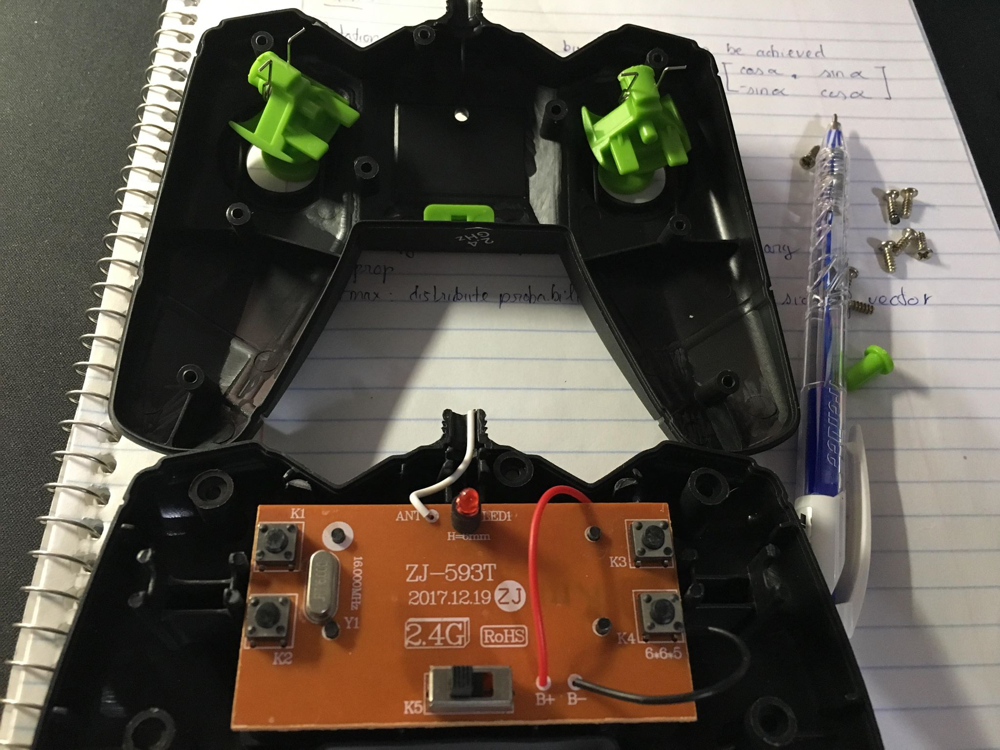

## RC-toy-car-RaspberryPi

Modify rc toy car using Raspberry Pi using original joy stick (no new motors or replays required). 
Feed live video from RPi, control with manual and auto mode (later on).

It took me more than 1 week full time to implement the idea since I tried to find the tutorial but noone have done this way before, gladly it works.
Good practice for RPi usuage and python programming. 
Future work: working on auto (self-driving/obstacle avoidance) mode using IR and camera (apply OpenCV and tensorflow). 


### 1. Here the plan


### 2. Get the joystick board and connect each pin from each button to a pin of RPi (all the Ground pins are connected to Ground pin of RPi).
Then you should be able to control the joystick signal from RPI just like when you press the joystick buttons.




### 3. Follow the tutorial to transfer live video from RPi to any devices using website browers.
```
https://elinux.org/RPi-Cam-Web-Interface
```

### 4. Download the repo and see the .py files
Make sure to understand 3 main script files mainRC.py, rc.py, and setupPins.py


### 5. Test your new car (take longest time)
The process of tuning the wheeling time, servo module, and debug will take longest time (although it takes least works compared to the others).


### 6. Assembly everything together with battery, camera... 

First Version: 


Final Version: with wide-angle len to see more ( ͡° ͜ʖ ͡°)


### Good luck. If anyone interested to make one, just shoot an message so I can show more detail. 


